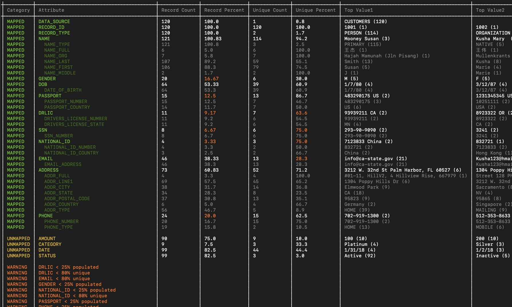

# sz-json-analyzer

## Overview

This is a python utility used to analyze [Senzing mapped JSON data](https://senzing.zendesk.com/hc/en-us/articles/231925448-Generic-Entity-Specification) files before loading into Senzing.

### Prerequisites
- Python 3.6 or higher
- Senzing API version 3.0 or higher
- python pretty table module (pip3 install prettytable)

### Installation

Place the following files in a directory of your choice:  
- [sz_json_analyzer.py](sz_json_analyzer.py)
- [sz_default_config.json](sz_default_config.json)

Note: Ideally, you run this utility with the Senzing environment set to your project so that it picks up the latest configuration.  However, it will use the [sz_default_config.json](sz_default_config.json) if you run it without.

## Usage

```console
usage: sz_json_analyzer.py [-h] [-i INPUT_FILE] [-o OUTPUT_FILE]

optional arguments:
  -h, --help            show this help message and exit
  -i INPUT_FILE, --input_file INPUT_FILE
                        the name of the input file
  -o OUTPUT_FILE, --output_file OUTPUT_FILE
                        optional name of the output file
                        ```
## Sample output



The green "mapped" section shows all the fields the Senzing config recognized with population and uniqueness percent with the top 10 most used values.
